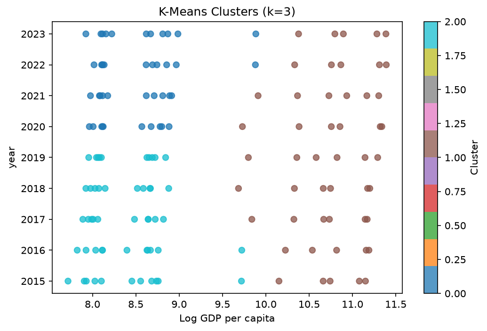
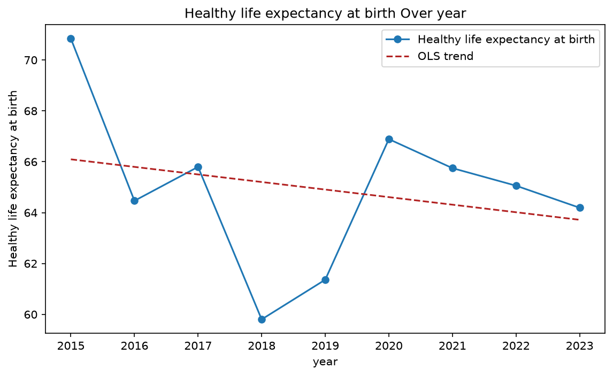
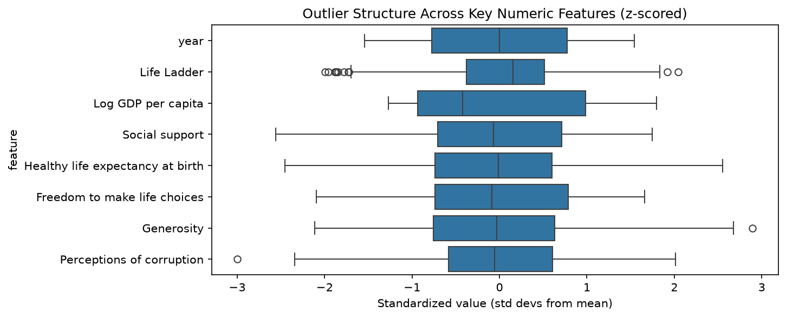

# Autolysis

[](https://github.com/Barath-Grama/autolysis/actions/workflows/ci.yml)
[](https://github.com/Barath-Grama/autolysis/actions/workflows/ci.yml)
[](https://www.python.org/downloads/)
[](LICENSE)

**Autolysis** is an intelligent, fully automated CSV analysis engine. Point it at a
CSV file and it will:

1. **Profile** the dataset (dtypes, null ratios, summary stats, categorical
   cardinality and frequency shape).
2. Ask **Gemini** which of five supported analyses are most appropriate for the data.
3. Run those analyses **locally** with pandas / scikit-learn / matplotlib. What
   leaves your machine is column *names* and aggregate statistics — never cell
   values, not even the most frequent ones (see [What gets sent](#what-gets-sent)).
4. Ask Gemini a second time to **narrate** the numeric findings into a polished,
   chart-embedded `README.md`.

A typical run takes 15–40 seconds and replaces what would otherwise be hours of
manual exploratory analysis.

```
CSV Input → Data Profiler → LLM Call #1 (analysis routing)
   → Local Analysis Engine (correlation / outliers / clustering / time_series / category_analysis)
   → chart .png files → LLM Call #2 (narrative) → README.md
```

## Example output

One command, 2.4 seconds, no API key required:

```bash
python autolysis.py sample_data/happiness.csv --offline --max-analyses 5
```

<table>
<tr>
<td width="50%"></td>
<td width="50%"></td>
</tr>
<tr>
<td width="50%"></td>
<td width="50%"></td>
</tr>
</table>

The generated report doesn't stop at the charts — it states what it found and
what to do next, citing the numbers behind each claim:

> **Correlation** — The strongest linear relationship is **Life Ladder** vs
> **Log GDP per capita** (r = +0.361).
>
> **Outliers** — 13 values across 3 of 8 numeric columns fall outside 1.5x IQR
> from the quartiles.
>
> **Clustering** — K-Means settled on **k = 3** over *Log GDP per capita* and
> *year*, the two columns carrying the most cluster structure (silhouette 0.4656).
>
> **What to do with this**
> 1. Probe **Life Ladder** against **Log GDP per capita** (r = +0.361) — strong
>    enough to be worth a causal look rather than a coincidence.
> 2. Audit the 11 outlying values in **Life Ladder** before modelling — decide
>    whether they are data-entry errors or the signal itself.
> 3. The 3 clusters are only weakly separated (silhouette 0.4656); treat them as
>    a segmentation hypothesis to validate, not a finding.

**→ [Read the full generated report](docs/example/README.md)**

Everything above came from the `--offline` path, so it is exactly what CI
produces on every push and what you get without a key. With `GEMINI_API_KEY`
set, the same computed numbers are narrated by Gemini instead of the template.

## Quickstart

The fastest way to run Autolysis is with [`uv`](https://docs.astral.sh/uv/), which
reads the inline dependency metadata at the top of `autolysis.py` and provisions
an isolated environment automatically — no `pip install` or virtualenv needed.

```bash
export GEMINI_API_KEY="your-key-here"   # from https://aistudio.google.com/apikey
uv run autolysis.py sample_data/happiness.csv
```

This produces `happiness_output/` containing `README.md` plus one `.png` chart
per selected analysis.

### Without `uv`

```bash
python3 -m venv .venv && source .venv/bin/activate
pip install -r requirements.txt
export GEMINI_API_KEY="your-key-here"
python autolysis.py sample_data/goodreads.csv
```

### Without an API key

Autolysis can also run entirely offline (no Gemini calls at all). Analyses are
chosen from the dataset's own shape rather than by the model, and the report
comes from a deterministic template — handy for demos, CI, or air-gapped
environments. All five routines are reachable this way:

```bash
python autolysis.py sample_data/happiness.csv --offline --max-analyses 5
```

## CLI reference

```
usage: autolysis [-h] [-o OUTPUT_DIR] [-m MODEL] [--max-analyses MAX_ANALYSES]
                  [--top-categories TOP_CATEGORIES] [--offline] [--cache]
                  [--html] [-v]
                  csv_path

positional arguments:
  csv_path              Path to the CSV file to analyze.

options:
  -o, --output-dir      Output directory (default: ./<csv-stem>_output)
  -m, --model           Gemini model to use (default: env GEMINI_MODEL or
                         'gemini-2.5-flash-lite')
  --max-analyses N      Maximum number of analyses to run (default: 3)
  --top-categories N    Bars in the category frequency chart (default: 8)
  --offline             Skip all LLM calls; choose analyses from the data shape
                         and write a templated report
  --cache               Cache LLM responses on disk (.autolysis_cache/) to avoid
                         repeat API calls during development; entries expire
                         after 7 days
  --html                Additionally render report.html alongside README.md
  -v, --verbose          Enable debug logging
```

## Environment variables

| Variable                       | Purpose                                    |
|---------------------------------|---------------------------------------------|
| `GEMINI_API_KEY` / `GOOGLE_API_KEY` | Gemini API key (required unless `--offline`) |
| `GEMINI_MODEL`                  | Overrides the default model (`gemini-2.5-flash-lite`) |
| `AUTOLYSIS_CACHE_DIR`           | Where `--cache` writes (default `./.autolysis_cache`) |

A `.env` file in the working directory is loaded automatically; real
environment variables always take precedence over it. Copy `.env.example` to
`.env` to get started.

## Supported analyses

Gemini selects up to `--max-analyses` (default 3) of the following, based on the
dataset's structure — a fixed pipeline would run all five unconditionally and
often produce meaningless charts on the wrong dataset shape:

| Analysis             | Technique                                                          |
|-----------------------|---------------------------------------------------------------------|
| `correlation`          | Pearson correlation matrix → heatmap                               |
| `outliers`             | IQR (Tukey fence) outlier detection → z-scored box plot             |
| `clustering`            | K-Means on the two most cluster-structured numeric columns (ranked by scale-invariant excess kurtosis), k ∈ [2, 8] chosen by silhouette score → scatter plot |
| `time_series`           | Heuristic time-column detection + OLS trend against real elapsed time |
| `category_analysis`     | Top-N frequency bar chart for the richest categorical column        |

Every routine degrades gracefully — e.g. clustering is skipped with a clear
reason if fewer than two numeric columns are present — so the pipeline always
completes and always produces a report.

## Project layout

```
autolysis.py           # the entire pipeline — single, uv-executable script
tests/
  test_autolysis.py    # unit tests (all Gemini calls mocked, no network needed)
sample_data/
  goodreads.csv        # synthetic book-metadata dataset for demos
  happiness.csv        # synthetic multi-year, multi-country wellbeing dataset
docs/example/          # a committed run of the pipeline, embedded above
  README.md            # the generated report
  *.png                # the charts it produced
.github/workflows/
  ci.yml               # lint, test matrix, and an end-to-end smoke run
requirements.txt       # pinned deps for non-uv / pip workflows
pyproject.toml         # packaging, pytest, coverage and ruff config
.env.example           # environment variable template
```

> **Note on sample data:** `sample_data/*.csv` are synthetically generated
> (see the generation notes in each file's header comment context) to mirror
> the structure of the well-known Goodreads and World Happiness Report
> datasets without redistributing the original copyrighted data. Swap in the
> real files if you have them — the column-name heuristics will still work.

## Running the tests

```bash
pip install -r requirements.txt
pytest tests/ -v
```

All 101 tests mock the Gemini API (`unittest.mock`), so the suite runs fully
offline and deterministically. Coverage includes:

- IQR outlier boundary correctness (equivalence partitioning at the Tukey fence)
- K-Means elbow-method k-selection
- LLM routing response parsing — valid JSON, code-fenced JSON, unknown
  identifiers silently dropped, fully malformed text falling back safely
- Chart file creation/non-zero size for every analysis routine
- End-to-end `README.md` generation with a mocked two-call LLM sequence
- Graceful degradation: single numeric column, empty CSV, missing file,
  missing API key, no temporal/categorical columns
- Secret hygiene: the API key is sent as a header and never appears in a
  raised error, plus a redaction backstop for third-party error text
- CSV encoding fallback: latin-1/cp1252 input is decoded rather than crashing,
  UTF-8 still takes precedence, malformed CSVs raise a clean error
- `--max-analyses` propagating from the CLI into the routing prompt itself
- Clustering axis selection being scale-free: rescaling a column's units must
  not reshuffle the ranking, and structured columns must outrank plain noise
- Silhouette k-selection recovering 2, 3 and 5 clusters from known blobs —
  including the endpoints the previous elbow heuristic could never return
- No cell value from a PII-shaped frame appearing in either prompt
- Retry policy: 400/404/422 failing on the first attempt, 429/5xx retrying,
  `Retry-After` overriding local backoff, 403 short-circuiting to auth failure
- Trend slopes measured per time unit, over irregular spacing, datetime
  indices, and string dates that must not sort lexicographically
- HTML sanitisation: `<script>`, `<iframe>`, `onerror=`, `javascript:` URLs and
  inline `style` stripped, while headings, tables, code and relative chart
  `` links survive
- Cache behaviour: hit/miss, TTL expiry, and `json_mode` producing a distinct
  key rather than colliding with the plain-text entry
- `.env` loading, including a real environment variable winning over the file
- Offline selection reaching `time_series` and `category_analysis`, and
  degrading to a single routine on a one-column frame

## Architecture notes

- **Two LLM calls, not more.** Call #1 sends only column-level metadata and
  gets back a JSON array of analysis identifiers drawn from a closed
  vocabulary, so a non-compliant response can never trigger an unsupported
  routine. Call #2 sends the computed numeric results and chart filenames and
  gets back the final Markdown narrative.

<a name="what-gets-sent"></a>
- **What gets sent.** Column names, dtypes, null percentages, numeric
  five-number summaries, and for categorical columns the distinct count plus
  the top-5 *frequencies* — `[12, 9, 8, 8, 7]`, not the labels they belong to.
  Sending the top-5 values themselves would mean shipping names, emails or
  diagnoses to a third party under the banner of "aggregate statistics"; the
  counts carry the signal the router needs (is this low-cardinality, is it
  skewed) without the contents. Three tests assert that no cell value from the
  sample data appears in either prompt.
- **Sequential execution.** Analysis routines run one after another rather
  than concurrently: each is dominated by already-parallelized pandas/
  scikit-learn internals, and charts must exist on disk before the
  narrative prompt is assembled.
- **Resilience beyond the original design.** Gemini calls retry with
  exponential backoff; if the narrative call still fails, Autolysis falls
  back to a deterministic templated report rather than crashing.
- **Scale-invariant clustering axes.** Picking the two *highest-variance*
  columns picks by unit — salaries in dollars always beat ratings in [0, 1] —
  and standardising first doesn't rescue it, since every standardised column
  has variance 1 by construction. Excess kurtosis is scale-invariant and
  responds to what K-Means wants: bimodal columns are platykurtic, plain
  gaussians sit near zero, outlier-dominated columns are leptokurtic.
- **Silhouette over elbow for k.** The elbow heuristic scored second
  differences of inertia, which can only ever nominate an *interior* k — with
  k drawn from 2..5 it was structurally incapable of returning 2 or 5. The
  silhouette score is defined independently at every k, so no candidate is
  excluded by the shape of the formula. Scoring is row-capped because
  silhouette is O(n²).
- **Trends regress against elapsed time.** Fitting against row position makes
  2000, 2001 and 2020 evenly spaced and yields a slope "per observed point"
  that carries no unit. Slopes are now per year / per day, and reported with
  the unit attached.
- **Retries only where retrying can help.** 408/429/5xx back off exponentially
  and honour `Retry-After`; a 400 or 404 is deterministic and fails
  immediately rather than four times more slowly.
- **Secret handling.** The API key travels in the `x-goog-api-key` header, not
  a URL query parameter — httpx embeds the full request URL in its exception
  messages, so a query-string key leaks into every retry log line and error
  report. `redact_secret()` scrubs any residual occurrence as a backstop
  against third-party error text we don't control.
- **Encoding fallback.** Input is decoded through `utf-8 → utf-8-sig → cp1252
  → latin-1`. pandas defaults to UTF-8 and raises on anything else, but many
  real-world CSVs are Windows-Latin exports; a bare `read_csv` turns a routine
  file into an uncaught traceback.
- **`--offline` mode** runs the full local pipeline (profiling → analysis →
  chart rendering → templated report) with zero network calls, useful for
  CI, air-gapped environments, or quick demos. Analyses are picked from the
  data's shape — numeric arity, a detected time column, categorical
  cardinality — so every routine is reachable and testable without a key.
  The same selector is the fallback when a routing call fails.
- **`--cache`** memoizes LLM responses on disk so repeated runs against the
  same dataset during development don't re-incur API cost/latency. Entries
  key on model, prompt *and* response format, and expire after a week so a
  long-lived cache can't pin the pipeline to an answer from a model that has
  since changed.
- **`--html`** renders `report.html` from the generated Markdown. The
  narrative is model-generated and the file is meant to be shared, so the
  rendered markup goes through an allowlist sanitiser — python-markdown
  passes raw HTML straight through, and a report containing `<script>` would
  otherwise execute in whoever opens it. Tags whose content is code rather
  than prose are dropped wholesale, not merely unwrapped.
- **Deterministic routing, varied prose.** The routing call runs at
  temperature 0 — it is closed-vocabulary classification, and the same
  dataset should route the same way twice. The narrative call keeps 0.4.
- **Statistics use every row; only rendering samples.** Outlier counts and
  correlations are computed on the full frame. Plots and the O(n²) silhouette
  fit draw a capped, seeded sample, because a boxplot of five million points
  is illegible as well as slow.
