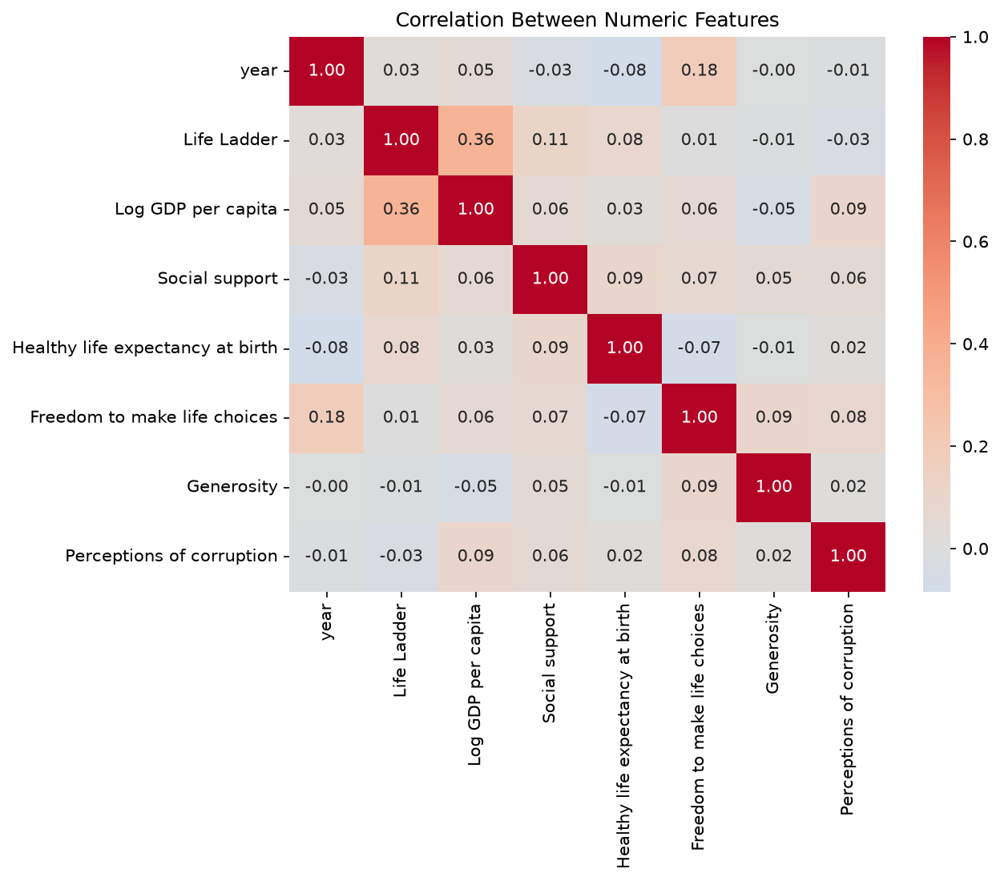

# Analysis of happiness

## The Data
144 rows across 9 columns, with 0 duplicate rows.
8 numeric and 1 categorical columns were profiled.
Most incomplete columns: `Healthy life expectancy at birth` (4.2% null), `Generosity` (4.2% null), `Perceptions of corruption` (4.2% null).

## What We Did
Selected from the data's own shape — numeric arity, a detected time column, categorical cardinality — with no model in the loop:
- **Correlation**
- **Outliers**
- **Time Series**
- **Category Analysis**
- **Clustering**

## What We Found

### Correlation

The strongest linear relationship is **Life Ladder** vs **Log GDP per capita** (r = +0.361).

| Feature A | Feature B | Pearson r |
|---|---|---:|
| Life Ladder | Log GDP per capita | +0.361 |
| year | Freedom to make life choices | +0.177 |
| Life Ladder | Social support | +0.114 |
| Log GDP per capita | Perceptions of corruption | +0.094 |
| Social support | Healthy life expectancy at birth | +0.093 |

### Outliers

13 values across 3 of 8 numeric columns fall outside 1.5x IQR from the quartiles.

| Column | Outliers |
|---|---:|
| Life Ladder | 11 |
| Generosity | 1 |
| Perceptions of corruption | 1 |

### Time Series

**Healthy life expectancy at birth** is decreasing over *year*, at -0.2972 Healthy life expectancy at birth per unit of year on an ordinary-least-squares fit.

### Category Analysis

*Country name* is the richest categorical column; its most common values are below.

| Country name | Count |
|---|---:|
| Finland | 9 |
| Denmark | 9 |
| Iceland | 9 |
| Switzerland | 9 |
| Netherlands | 9 |
| Norway | 9 |
| Sweden | 9 |
| New Zealand | 9 |

### Clustering

K-Means settled on **k = 3** over *Log GDP per capita* and *year*, the two columns carrying the most cluster structure (silhouette 0.4656).

| Cluster | Log GDP per capita | year |
|---|---:|---:|
| 0 | 8.5 | 2021.55 |
| 1 | 10.75 | 2019.0 |
| 2 | 8.38 | 2016.94 |

## What To Do With This

1. Probe **Life Ladder** against **Log GDP per capita** (r = +0.361) — strong enough to be worth a causal look rather than a coincidence.
2. Audit the 11 outlying values in **Life Ladder** before modelling — decide whether they are data-entry errors or the signal itself.
3. **Healthy life expectancy at birth** trends decreasing over year; confirm the trend survives segmentation before reporting it.
4. The 3 clusters are only weakly separated (silhouette 0.4656); treat them as a segmentation hypothesis to validate, not a finding.

---

*Generated by [Autolysis](https://github.com/Barath-Grama/autolysis) in `--offline` mode: every figure above was computed locally, with no LLM in the loop. With a Gemini key, the same numbers are narrated by the model instead of this template.*