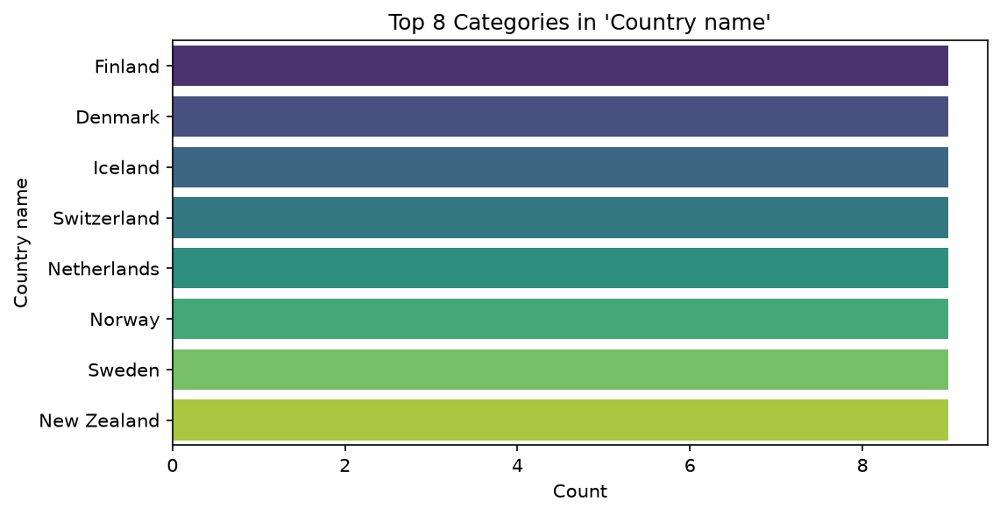

# Happiness Dataset Analysis Report

## The Data

The dataset contains information on happiness and related factors across different countries and years. It comprises 144 rows and 9 columns. There are no duplicate rows.

**Column Summary:**

*   **Country name** [categorical]: 16 distinct values, 0.0% nulls.
*   **year** [numeric]: Mean=2019, Std=2.591, Min=2015, Max=2023, 0.0% nulls.
*   **Life Ladder** [numeric]: Mean=5.721, Std=0.9762, Min=3.772, Max=7.718, 0.0% nulls.
*   **Log GDP per capita** [numeric]: Mean=9.24, Std=1.198, Min=7.718, Max=11.39, 0.0% nulls.
*   **Social support** [numeric]: Mean=0.7896, Std=0.1205, Min=0.481, Max=1, 0.0% nulls.
*   **Healthy life expectancy at birth** [numeric]: Mean=64.79, Std=7.925, Min=45.34, Max=85, 4.2% nulls.
*   **Freedom to make life choices** [numeric]: Mean=0.7501, Std=0.1505, Min=0.435, Max=1, 0.0% nulls.
*   **Generosity** [numeric]: Mean=0.08009, Std=0.1468, Min=-0.23, Max=0.505, 4.2% nulls.
*   **Perceptions of corruption** [numeric]: Mean=0.6319, Std=0.183, Min=0.083, Max=1, 4.2% nulls.

## What We Did

We performed the following analyses on the dataset:

*   **Correlation Analysis:** Examined the relationships between different variables.
*   **Outlier Detection:** Identified potential outliers in numerical columns.
*   **Time Series Analysis:** Investigated trends over time for a specific variable.
*   **Category Analysis:** Analyzed the frequency of categories within the 'Country name' column.

## What We Found

### Correlation

The correlation analysis revealed several relationships:

*   A positive correlation of 0.361 between 'Life Ladder' and 'Log GDP per capita'.
*   A positive correlation of 0.177 between 'year' and 'Freedom to make life choices'.
*   A positive correlation of 0.114 between 'Life Ladder' and 'Social support'.
*   A positive correlation of 0.094 between 'Log GDP per capita' and 'Perceptions of corruption'.
*   A positive correlation of 0.093 between 'Social support' and 'Healthy life expectancy at birth'.

### Outliers

Outlier detection identified the following:

*   'Life Ladder' has 11 outliers.
*   'Generosity' has 1 outlier.
*   'Perceptions of corruption' has 1 outlier.
*   No outliers were found in 'year', 'Log GDP per capita', 'Social support', 'Healthy life expectancy at birth', or 'Freedom to make life choices'.

### Time Series

The time series analysis for 'Healthy life expectancy at birth' shows a **decreasing** trend. The slope is -0.2972, indicating a decrease of 0.2972 units of 'Healthy life expectancy at birth' per unit of 'year'.

### Category Analysis

The 'Country name' column shows the following top categories by frequency:

*   Finland: 9 occurrences
*   Denmark: 9 occurrences
*   Iceland: 9 occurrences
*   Switzerland: 9 occurrences
*   Netherlands: 9 occurrences
*   Norway: 9 occurrences
*   Sweden: 9 occurrences
*   New Zealand: 9 occurrences

## What To Do With This

Based on the analysis, the following actions are recommended:

1.  **Investigate Drivers of Life Ladder:** Given the positive correlation between 'Life Ladder' and 'Log GDP per capita' (0.361), further analysis could explore how economic development impacts happiness. The moderate positive correlation with 'Social support' (0.114) suggests its importance, which could be a focus for interventions.
2.  **Address Declining Life Expectancy:** The decreasing trend in 'Healthy life expectancy at birth' warrants investigation. Understanding the factors contributing to this decline is crucial for public health initiatives.
3.  **Explore Outlier Impacts:** The identified outliers in 'Life Ladder', 'Generosity', and 'Perceptions of corruption' should be examined to understand if they represent unique cases or systemic issues that could provide valuable insights.
4.  **Leverage Top Performing Countries:** The countries appearing frequently in the top categories (Finland, Denmark, Iceland, etc.) could serve as benchmarks. Analyzing their policies and societal structures might offer best practices for improving happiness and well-being in other nations.
5.  **Consider Corruption's Influence:** The positive correlation between 'Log GDP per capita' and 'Perceptions of corruption' (0.094) is counterintuitive and suggests that economic growth does not automatically reduce corruption. Further research into this relationship is recommended.